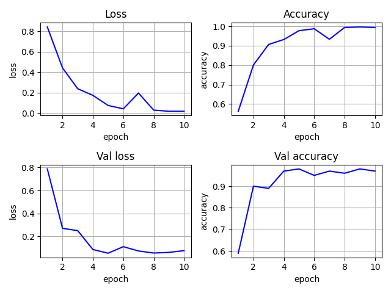

# 8382, Мирончик Павел, вар. 6

### Генерация данных

```
def gen_prepared_data(size = 500, img_size = 50):
    _data, _labels = var6.gen_data(size=size, img_size=img_size)
    _data = _data.reshape(size, img_size, img_size)
    _labels = _labels.reshape(size)

    indices = np.array(range(size))
    np.random.shuffle(indices)
    _data = np.take(_data, indices, axis=0)
    _labels = np.take(_labels, indices)

    _encoder = LabelEncoder()
    _encoder.fit(_labels)
    _labels = _encoder.transform(_labels).reshape(size)
    _classes = np.unique(_labels).shape[0]
    _labels = utils.to_categorical(_labels, _classes)

    return _data, _labels
```

Используя данные в задании функции генерируется изображение (фактически двумерный массив),
содержащее от 1 до 3 вертикальных крестов. Полученные данные перемешиваются, и категории
кодируются с использованием LabelEncoder, переводящего строки в цифры, а затем
через `to_categorical` в двоичную классную матрицу.

ИНС представляет из себя три сверточных слоя, после каждого из которых следует слой 
субдискретизации, и за ними два полносвязных слоя.

```
inp = layers.Input(shape=(img_size, img_size, 1))
conv_1 = layers.Convolution2D(conv_depth_1, kernel_size, padding='same', activation='relu')(inp)
pool_1 = layers.MaxPooling2D(pool_size=(pool_size, pool_size))(conv_1)
conv_2 = layers.Convolution2D(conv_depth_2, kernel_size, padding='same', activation='relu')(pool_1)
pool_2 = layers.MaxPooling2D(pool_size=(pool_size, pool_size))(conv_2)
conv_3 = layers.Convolution2D(conv_depth_3, kernel_size, padding='same', activation='relu')(pool_2)
pool_3 = layers.MaxPooling2D(pool_size=(pool_size, pool_size))(conv_3)
flat = layers.Flatten()(pool_3)
hidden = layers.Dense(hidden_size, activation='relu')(flat)
out = layers.Dense(labels.shape[1], activation='softmax')(hidden)
```

В ходе исследований тестировались сети с различными размерами ядер свертки, количеством
пар слоев conv-pool, и выбранная архитектура дала лучший результат.

```
Epoch 10/10
90/90 [==============================] - 2s 26ms/step - loss: 0.0086 - accuracy: 0.9981 - val_loss: 0.0769 - val_accuracy: 0.9700
2/2 [==============================] - 0s 12ms/step - loss: 0.0331 - accuracy: 0.9800
```



Видно, что ИНС достаточно быстро обучается, однако не достигает максимальной точности.
Эта проблема объясняется достаточно просто: при некотором невезении кресты могут наложиться
друг на друга так, что один полностью перекроет другой. В результате определить, какое 
именно количество крестов находится на картинке, не представляется возможным. С учетом
этого ИНС показывает результат, близкий к идеальному.