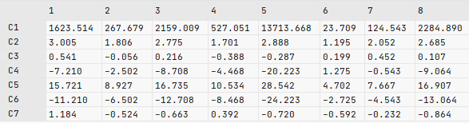
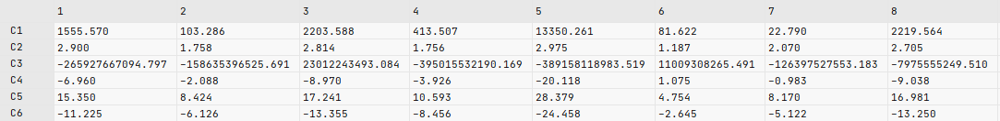
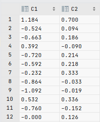

# Практическая работа № 5
Необходимо в зависимости от варианта сгенерировать датасет и сохранить его в формате csv.

Построить модель, которая будет содержать в себе автокодировщик и регрессионную модель. 
Схематично это должно выглядеть следующим образом:


Обучить модель и разбить обученную модель на 3: 
Модель кодирования данных (Входные данные -> Закодированные данные), 
модель декодирования данных (Закодированные данные -> Декодированные данные), 
и регрессионную модель (Входные данные -> Результат регрессии).

В качестве результата представить исходный код, сгенерированные данные в формате csv, 
кодированные и декодированные данные в формате csv, результат регрессии в формате csv 
(что должно быть и что выдает модель), и сами 3 модели в формате h5.

## Задание

Вариант 2

X ∈ N(-5,10)

e ∈ N(0,0.3)

| Признак       | 1      | 2            | 3         | 4       | 5    | 6               | 7|
| ------------- |--------| -----        | ---       | ---     | ---  | ---             |---|
| Формула       | -X^3+e | ln(abs(X))+e | sin(3X)+e | exp(X)+e| X+4+e|-X+sqrt(abs(X))+e|X+e|

Цель: признак № 3

## Выполнение работы

Сгенерируем данные согласно заданию. Для обучения сгенерируем 1000 наблюдений, для тестирования -- 200.
```python
fns = [
    lambda x: -np.power(x, 3),
    lambda x: np.log(np.abs(x)),
    lambda x: np.sin(3 * x),
    lambda x: np.exp(x),
    lambda x: x + 4,
    lambda x: -x + np.sqrt(np.abs(x)),
    lambda x: x
]

def generate(
        functions: List[Callable], target_index: int = 0, n_samples: int = 1000,
        x_normal_loc: float = 0., x_normal_scale: float = 1.,
        e_normal_loc: float = 0., e_normal_scale: float = 0.1
) -> np.array:
    X = np.random.normal(loc=x_normal_loc, scale=x_normal_scale, size=n_samples)
    e = np.random.normal(loc=e_normal_loc, scale=e_normal_scale, size=n_samples)
    features = np.array(
        [np.array(function(X) + e) for index, function in enumerate(functions) if index != target_index]
    ).T
    target = np.array([functions[target_index](X) + e]).T
    return np.hstack((features, target))

target_index = 2  # third function
generate_for_task = lambda num: generate(fns, target_index, num, -5., 10., 0., 0.3)
np.savetxt("samples/train.csv", generate_for_task(1000), delimiter=",", fmt='%1.3f')
np.savetxt("samples/test.csv", generate_for_task(200), delimiter=",", fmt='%1.3f')
```

Пример строки данных:

| f1  |  f2 |  f4 |  f5 | f6  | f7  | f3  |
| --- | --- | --- | --- | --- | --- | --- |
|0.420|-2.996|1.387|4.387|0.634|0.387|0.321|


Считаем и нормализуем данные
```python
train_data = np.genfromtxt("samples/train.csv", delimiter=",")
test_data = np.genfromtxt("samples/test.csv", delimiter=",")

train_x, train_y = train_data[:, :6], train_data[:, 6]
test_x, test_y = test_data[:, :6], test_data[:, 6]

mean = train_x.mean(axis=0)
std = train_x.std(axis=0)
train_x = (train_x - mean) / std
test_x = (test_x - mean) / std
```

Создадим и обучим модели
```python
basic_input_layer = Input(shape=(6,))

def create_encoder() -> Dense:
    encoded = Dense(64, activation='relu')(basic_input_layer)
    encoded = Dense(32, activation='relu')(encoded)
    encoded = Dense(8, activation='relu', name='encode')(encoded)
    return encoded

def create_decoder(input_layer: Dense) -> Dense:
    decoded = Dense(32, activation='relu')(input_layer)
    decoded = Dense(64, activation='relu')(decoded)
    decoded = Dense(6, name='decode')(decoded)
    return decoded

def create_regression(input_layer: Dense) -> Dense:
    predicted = Dense(64, activation='relu')(input_layer)
    predicted = Dense(32, activation='relu')(predicted)
    predicted = Dense(16, activation='relu')(predicted)
    predicted = Dense(8, activation='relu')(predicted)
    predicted = Dense(1, name="predict")(predicted)
    return predicted

encoder_output = create_encoder()
decoder_output = create_decoder(encoder_output)
regression_output = create_regression(encoder_output)

encoder = Model(basic_input_layer, encoder_output, name='encoder')
decoder = Model(basic_input_layer, decoder_output, name='decoder')
regression = Model(basic_input_layer, regression_output, name='regression')

model = Model(inputs=[basic_input_layer], outputs=[
    decoder_output,
    regression_output
])

model.compile(optimizer='adam', loss='mse', metrics='mae')
history = model.fit(train_x, [train_x, train_y], epochs=100, batch_size=10,
                    verbose=1, validation_split=0.8)
```

Получим предсказания модели и сохраним их в csv файлы

```python
encoded_test = encoder.predict(test_x)
decoded_test = decoder.predict(test_x)
regression_test = regression.predict(test_x)

decoded_test = decoded_test * std + mean

np.savetxt('samples/encoded.csv', encoded_test, delimiter=',', fmt='%1.3f')
np.savetxt('samples/decoded.csv', decoded_test, delimiter=',', fmt='%1.3f')
np.savetxt('samples/regression.csv', np.vstack((test_y, regression_test[:, 0])).T, delimiter=',', fmt='%1.3f')
```

## Анализ полученных результатов

После обучения итоговой модели на 100 эпохах были получены следующие результаты
```
Epoch 100/100
20/20 [==============================] - 0s 4ms/step - loss: 0.4269 - decode_loss: 0.0024 - predict_loss: 0.4245 - decode_mae: 0.0369 - predict_mae: 0.5746 - val_loss: 0.7927 - val_decode_loss: 0.2196 - val_predict_loss: 0.5731 - val_decode_mae: 0.0463 - val_predict_mae: 0.6474
```

Проанализируем работу связки `encoder`-`decoder`, для этого сравним первые несколько строк файла
`test.csv` и `decoded.csv`

Файл `test.csv`



Файл `decoded.csv`



Сравним сначала строки C6 (функция `x -> x + e`).
Эти строки отличаются, но не сильно, можно считать, что такая потеря точности нас устраивает.

Строки C4 должны отличаться на 4 от строк C6 (функция `x -> x + 4 + e`).
На глаз данное соотношение сохраняется.

Хуже всего дела обстоят с быстрорастущими функциями `x -> -x^3 + e` и `x -> e^x + e`.
Если с кубом (C1) сохраняются приблизительные соотношения, то с экспонентой(C3) возникают серьезные проблемы.
Ее значения распределены крайне неравномерно. В теории x может получиться порядка 30 
и будет `e^30`, либо `x = 0` и `f(x) = 1`.
Для работы с подобными функциями необходимо использовать другие подходы.

Тест регрессии приведен в файле `regression.csv`



MAE модели было относительно высоким, что сделало свой вклад.
Абсолютная погрешность предсказаний порядка 0.8.
В защиту скажу, что мы предсказывали значение синуса с небольшим шумом и не получили значений,
выходящий (с определенной погрешностью) за интервал `[-1,1]`, т.е. соотношение между признаками сохранили.
