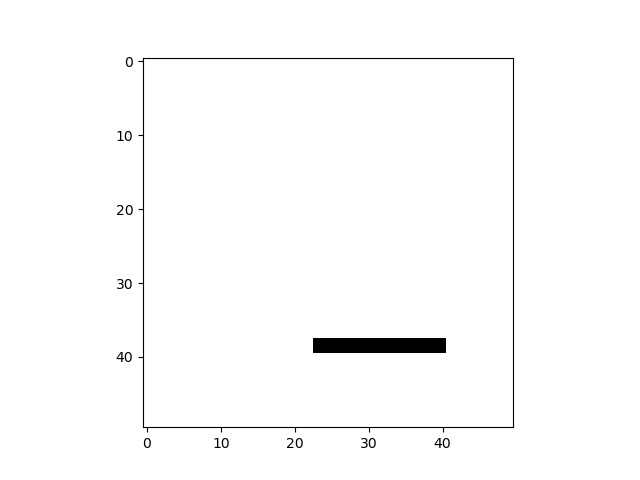
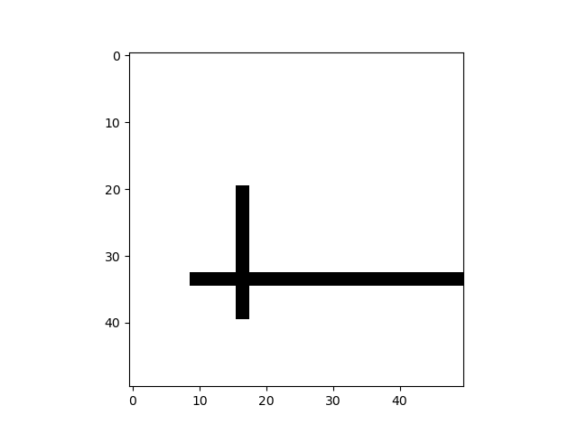
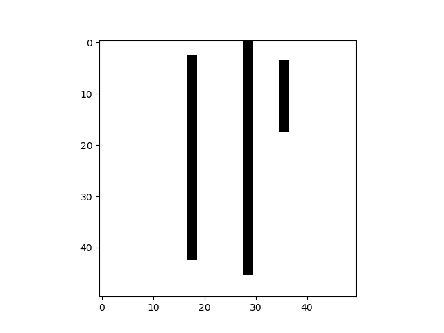
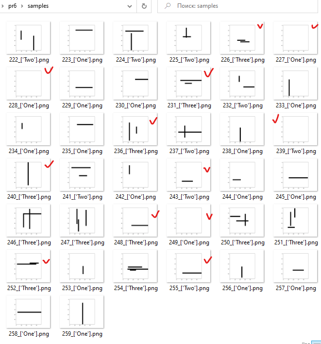

# Практическая работа № 6
Необходимо построить сверточную нейронную сеть, 
которая будет классифицировать черно-белые изображения с 
простыми геометрическими фигурами на них.

К каждому варианту прилагается код, который генерирует изображения.

Для генерации данных необходимо вызвать функцию gen_data, которая возвращает два тензора:

1. Тензор с изображениями ранга 3
1. Тензор с метками классов

Обратите внимание:

* Выборки не перемешаны, то есть наблюдения классов идут по порядку
* Классы характеризуются строковой меткой
* Выборка изначально не разбита на обучающую, контрольную и тестовую
* Скачивать необходимо оба файла
* Подключать файл, который начинается с var (в нем и находится функция gen_data)

## Задание

Вариант 7

Классификация изображений по количеству линий на них. Может быть 1, 2 или 3.

## Выполнение работы

Проверим то, как могут выглядеть изображения с линиями.

|  |
|:---:|
|Одна линия|

|  |
|:---:|
|Две линии|

|  |
|:---:|
|Три линии|

Проверим на адекватность также и кусок датасета.
Вызовем функцию генерации со стандартными параметрами (500 изображений со сторонами
50х50) и перемешаем наблюдения.

```python
from pr6.src.var7 import gen_data

...

X, y = gen_data()
X, y = sklearn.utils.shuffle(X, y)
for i in range(222, 260):
    plt.imshow(X[i], cmap=plt.cm.binary)
    plt.savefig(f"samples/{i}_{y[i]}.png")
```

|  |
|:---:|
|Случайный кусок датасета|

Тут выясняется, что исходные данные генерируются некорректно, линии могут слипаться или их может вообще
не быть.
Иными словами, программа генератор решила нарисовать 3 линии, поставила метку `Three`, но, например, две из линий
покрыли друг друга.
Попробуем обучить модель на таких данных и посмотрим, каких можно достичь результатов.

Сгенерируем побольше наблюдений в надежде, что 
артефактов станет меньше. 
Подготовим данные с помощью декорированной функции `prepare_data`.
```python
image_side = 50
n_samples = 2000
train_size = 0.9

@train_test
@normalize
@one_hot_y
@shuffle
@encode_labels
def prepare_data():
    global n_samples, image_side
    return gen_data(n_samples, image_side)

train_x, train_y, test_x, test_y = prepare_data()
```

Где каждый из декораторов выглядит примерно так:
```python
def encode_labels(fn):
    def wrapper():
        x, y = fn()
        return x, LabelEncoder().fit_transform(y)
    
    return wrapper
```

Построим `Sequential` модель (нам не нужны ответвления и другие нелинейные структуры слоев)
из следующих слоев:
```python
layers = [
    Input(shape=(image_side, image_side, 1)),
    Convolution2D(filters=32, kernel_size=(7, 7), padding="same", activation="relu"),
    MaxPooling2D(pool_size=(5, 5), padding="same"),
    Convolution2D(filters=64, kernel_size=(7, 7), padding="same", activation="relu"),
    MaxPooling2D(pool_size=(5, 5), padding="same"),
    Flatten(),
    Dense(512, activation="relu"),
    Dropout(0.25),
    Dense(256, activation="relu"),
    Dropout(0.15),
    Dense(3, activation="softmax")
]
```

Скомпилируем и обучим ее со следующими параметрами:
```python
model.compile(optimizer="adam", loss="categorical_crossentropy", metrics=["accuracy"])
history = model.fit(train_x, train_y, batch_size=20, epochs=10, validation_split=0.1)
```

Получаем следующие результаты
```
Epoch 9/10
81/81 [==============================] - 3s 38ms/step - loss: 0.5472 - accuracy: 0.7701 - val_loss: 0.7005 - val_accuracy: 0.6889
Epoch 10/10
81/81 [==============================] - 3s 38ms/step - loss: 0.4973 - accuracy: 0.7956 - val_loss: 0.7226 - val_accuracy: 0.6556
7/7 [==============================] - 0s 13ms/step - loss: 1.0106 - accuracy: 0.6150
```

|  |
|:---:|
|График функции потерь и точности от эпохи|

Получаем довольно слабые результаты ввиду наличия
артефактов во входных данных.