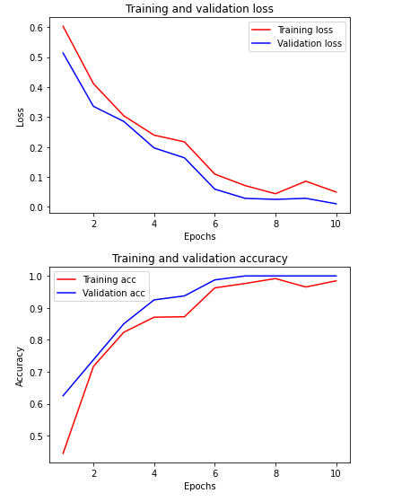

# Практика 6
## Вариант №6

Необходимо построить сверточную нейронную сеть, которая будет классифицировать черно-белые изображения с простыми геометрическими фигурами на них.

Для генерации данных необходимо вызвать функцию gen_data, которая возвращает два тензора:

- Тензор с изображениями ранга 3
- Тензор с метками классов

Обратите внимание:

- Выборки не перемешаны, то есть наблюдения классов идут по порядку
- Классы характеризуются строковой меткой
- Выборка изначально не разбита на обучающую, контрольную и тестовую

## Генерация данных
```
    def getData():
        data, labels = gen_data(size=1000)
        data, labels = shuffle(data, labels)
        dataTrain, dataTest, labelTrain, labelTest = train_test_split(data, labels, test_size=0.2, random_state=11)
        dataTrain = dataTrain.reshape(dataTrain.shape[0], 50, 50, 1)
        dataTest = dataTest.reshape(dataTest.shape[0], 50, 50, 1)
    
        encoder = LabelEncoder()
        encoder.fit(labelTrain)
        labelTrain = encoder.transform(labelTrain)
        labelTrain = to_categorical(labelTrain)
    
        encoder.fit(labelTest)
        labelTest = encoder.transform(labelTest)
        labelTest = to_categorical(labelTest)
        return dataTrain, labelTrain, dataTest, labelTest
```

## Описание решения

Модель сети:
```
    model = Sequential()
    model.add(Conv2D(32, kernel_size=3, padding="same", activation='relu', input_shape=(50, 50, 1)))
    model.add(MaxPool2D(pool_size=(2, 2)))
    model.add(Dropout(0.1))
    model.add(Conv2D(64, kernel_size=3,padding="same", strides=1, activation='relu'))
    model.add(Conv2D(64, kernel_size=3,padding="same", strides=1, activation='relu'))
    model.add(MaxPool2D(pool_size=(2, 2)))
    model.add(Dropout(0.1))
    model.add(Flatten())
    model.add(Dense(128, activation='relu'))
    model.add(Dropout(0.5))
    model.add(Dense(3, activation='softmax'))
```
Параметры обучения:
```
    model.compile(loss='binary_crossentropy', optimizer='adam', metrics=['accuracy'])
    
    history = model.fit(dataTrain, labelTrain, epochs=10, batch_size=10,validation_split=0.1)
```
На графиках показаны потери и точность модели во время обучения



В конце была проведена оценка модели на тестовых данных
```
7/7 [==============================] - 0s 4ms/step - loss: 0.0456 - accuracy: 0.9850
```

Модель близка к идеальной, но не достигает единицы из-за возможного наложения крестов, из-за чего возникает сложность с определением их количества.