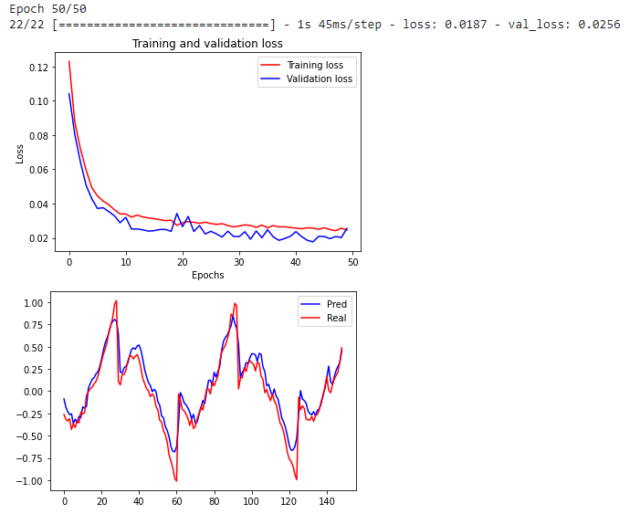
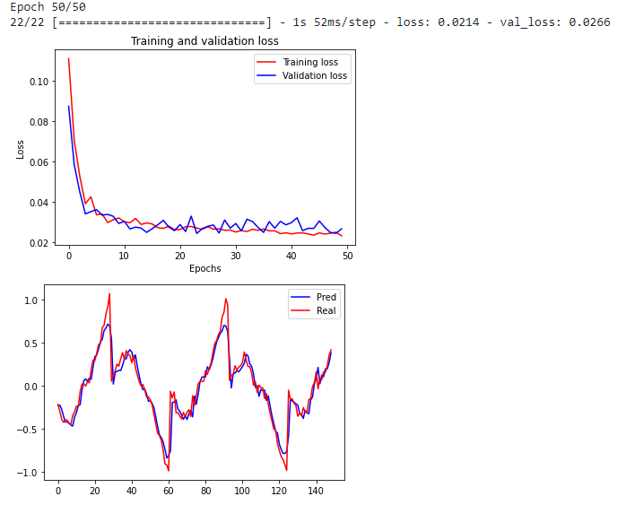

# Практика 7
## Вариант №6

Необходимо построить рекуррентную нейронную сеть, которая будет прогнозировать значение некоторого периодического сигнала.

К каждому варианту предоставляется код, который генерирует последовательность. Для выполнения задания необходимо:

- Преобразовать последовательность в датасет, который можно подавать на вход нейронной сети
- Разбить датасет на обучающую, контрольную и тестовую выборку
- Построить и обучить модель
- Построить график последовательности, предсказанной на тестовой выборке

## Код с генерацией последовательности для варианта
```
    def func(i):
        return (i % 16 + 1) / 16
    
    def gen_sequence(seq_len = 1000):
        seq = [math.cos(i/10) * func(i) + random.normalvariate(0, 0.04) for i in range(seq_len)]
        return np.array(seq)
    
    def draw_sequence():
        seq = gen_sequence(250)
        plt.plot(range(len(seq)),seq)
        plt.show()
```


## Преобразование в датасет и разделение на выборки
```
    def gen_data_from_sequence(seq_len=1000, lookback=10):
        seq = gen_sequence(seq_len)
        past = np.array([[[seq[j]] for j in range(i, i + lookback)] for i in range(len(seq) - lookback)])
        future = np.array([[seq[i]] for i in range(lookback, len(seq))])
        return (past, future)
    
    
    data, res = gen_data_from_sequence()
    dataset_size = len(data)
    train_size = (dataset_size // 10) * 7
    val_size = (dataset_size - train_size) // 2
    
    train_data, train_res = data[:train_size], res[:train_size]
    val_data, val_res = data[train_size:train_size+val_size], res[train_size:train_size+val_size]
    test_data, test_res = data[train_size+val_size:], res[train_size+val_size:]
```

## Исходная модель


## Построение и обучение модели
В ходе исследований была создана данная модель нейронной сети, наиболее прибиженная к начальной функции.
```
    model = Sequential()
    model.add(layers.GRU(128,recurrent_activation='sigmoid',input_shape=(None,1),return_sequences=True))
    model.add(layers.LSTM(64,activation='relu',input_shape=(None,1),return_sequences=True,dropout=0.2))
    model.add(layers.GRU(64,input_shape=(None,1),recurrent_dropout=0.2))
    model.add(layers.Dense(1))
    
    model.compile(optimizer='nadam', loss='mse')
    history = model.fit(train_data,train_res,epochs=50,validation_data=(val_data, val_res))
```

