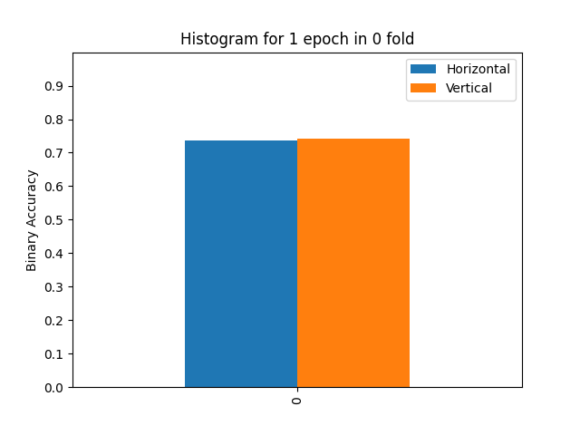
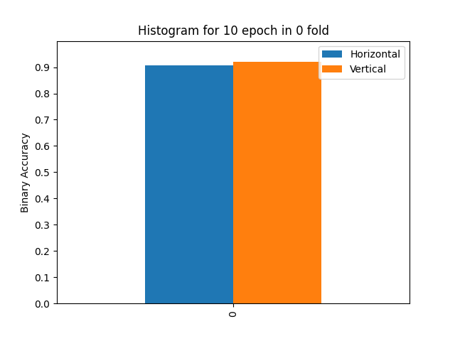

# Практическое задание №8

## Задание

Необходимо реализовать собственной CallBack, и провести обучение вашей модели из практического занятия №6 с написанным CallBack’ом. То, какой CallBack необходимо реализовать определяется вариантом.

### Варинат 3

Построение и сохранение нормированных гистограмм точности классификации наблюдений на заданных пользователем эпохах. Названия файлов с моделями должны иметь название соответствующее эпохе на которой была построена гистограмма

## Выполнение работы

За основу был взят код из практического задания №6. Для построения гистограмм точности классификации исходная модель была несколько изменена. В схему модели вместо одного выходного слоя было добавлено _n_ выходных слоев, где _n = количеству классов_. Это было сделано следующим образом:

```Python
target_names = ("Horizontal", "Vertical")

...

out = [Dense(2, name=name)(drop_3) for name in target_names]
model = Model(inputs=inp, outputs=out) 
```

Далее была написана функция для отрисовки одной гистограммы:

```Python
def saveHist(epoch, stats):
    plt.clf()
    data = dict(zip(target_names, stats))
    df = pandas.DataFrame(data, index=[0])
    titleString = "Histogram for " + str(epoch) + " epoch in " + str(fold_number) + " fold"
    yticks = np.arange(0, 1, 0.1)
    df.plot(kind="bar", title=titleString, ylim=[0, 1], yticks=yticks, ylabel="Binary Accuracy")
    plt.savefig("hist_" + str(fold_number) + "_" + str(epoch) + ".png")
```

Ввиду того, что в практическом задании №6 был применен метод перекрестной проверки по _k_ блокам, то в названии файла присутствует помимо номера эпохи и номер текущего блока. Далее был написан и передан в метод _fit_ собственный класс _Callback_ для отслеживания номеров эпох:

```Python
class HistogramLogger(Callback):
    def on_epoch_end(self, epoch, logs=None):
        if epochs_to_watch.count(epoch) > 0:
            stats = []
            for name in target_names:
                stats.append(logs[name + "_" + "binary_accuracy"])
            saveHist(epoch, stats)

...

history = model.fit(partial_train_data, partial_train_targets, epochs=epochs, batch_size=batch_size, validation_split=0, verbose=0, callbacks=[HistogramLogger()])
```

Ввод номеров эпох для отслеживания считывается из текстового файла:

```Python
if (not path.exists()):
    print("Oops! Can't find file hists.txt")
else:
    epochs_to_watch = ""
    with open(path.absolute()) as f:
        epochs_to_watch = f.read()

    epochs_to_watch = list(map(int, epochs_to_watch.split()))
```

Примеры получившихся гистограмм:




