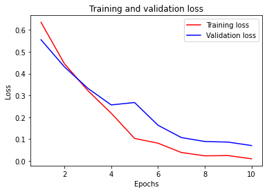
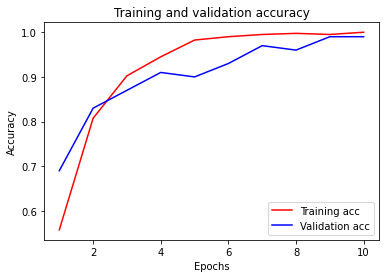

# Практическое задание №6, вариант 5

###  **Задание**

Необходимо построить сверточную нейронную сеть, которая будет классифицировать черно-белые изображения с простыми геометрическими фигурами на них.

Классификация изображений с прямоугольником или не закрашенным кругом.

### Выполнение работы:

Был подключен файл var5.py, из которого импортирована функция gen_data. С ее помощью была сгенерирована выборка параметров и ответов, которые функцией train_test_split были разделены на обучающую и тестовую выборки.

Модель нейронной сети:
 Conv2D(Размер ядра 3x3, выход – 32, ф-ция активации relu)
 MaxPooling2D(Размер пула 2x2)
 Flatten
 Dense(32 нейрона, ф-ция активации relu)
 Dropout(0.4)
 Dense(1 нейрон, ф-ция активации sigmoid)

 Был использован слой Dropout для избегания переобучения. Модель обучается 10 эпох с batch_szie = 16. 
 Оптимизатор – Adam, функция потерь – binary_crossentropy

###  **Тестирование**

Ниже представлены результаты обучения модели. 

Модель достигла точности 99% на тестовых данных.

```
Epoch 1/10

25/25 [==============================] - 1s 18ms/step - loss: 0.6466 - accuracy: 0.5730 - val_loss: 0.5554 - val_accuracy: 0.6900

Epoch 2/10

25/25 [==============================] - 0s 4ms/step - loss: 0.4624 - accuracy: 0.7915 - val_loss: 0.4312 - val_accuracy: 0.8300

Epoch 3/10

25/25 [==============================] - 0s 4ms/step - loss: 0.3439 - accuracy: 0.9014 - val_loss: 0.3328 - val_accuracy: 0.8700

Epoch 4/10

25/25 [==============================] - 0s 4ms/step - loss: 0.2377 - accuracy: 0.9341 - val_loss: 0.2565 - val_accuracy: 0.9100

Epoch 5/10

25/25 [==============================] - 0s 4ms/step - loss: 0.1162 - accuracy: 0.9809 - val_loss: 0.2674 - val_accuracy: 0.9000

Epoch 6/10

25/25 [==============================] - 0s 4ms/step - loss: 0.0774 - accuracy: 0.9906 - val_loss: 0.1633 - val_accuracy: 0.9300

Epoch 7/10

25/25 [==============================] - 0s 4ms/step - loss: 0.0474 - accuracy: 0.9974 - val_loss: 0.1067 - val_accuracy: 0.9700

Epoch 8/10

25/25 [==============================] - 0s 4ms/step - loss: 0.0236 - accuracy: 0.9957 - val_loss: 0.0888 - val_accuracy: 0.9600

Epoch 9/10

25/25 [==============================] - 0s 5ms/step - loss: 0.0345 - accuracy: 0.9901 - val_loss: 0.0858 - val_accuracy: 0.9900

Epoch 10/10

25/25 [==============================] - 0s 4ms/step - loss: 0.0091 - accuracy: 1.0000 - val_loss: 0.0701 - val_accuracy: 0.9900

4/4 [==============================] - 0s 3ms/step - loss: 0.0701 - accuracy: 0.9900
```

График потерь:



График точности:



