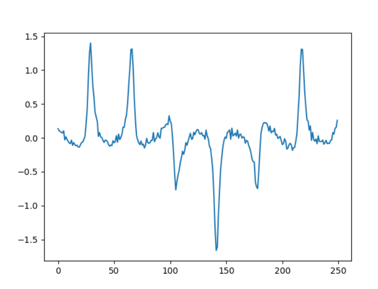
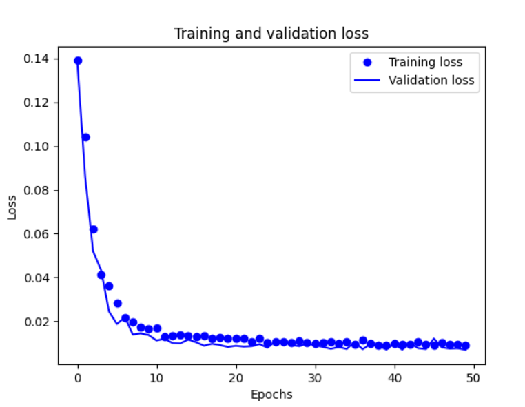
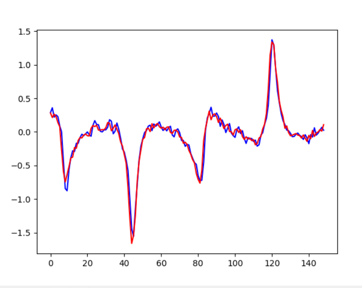
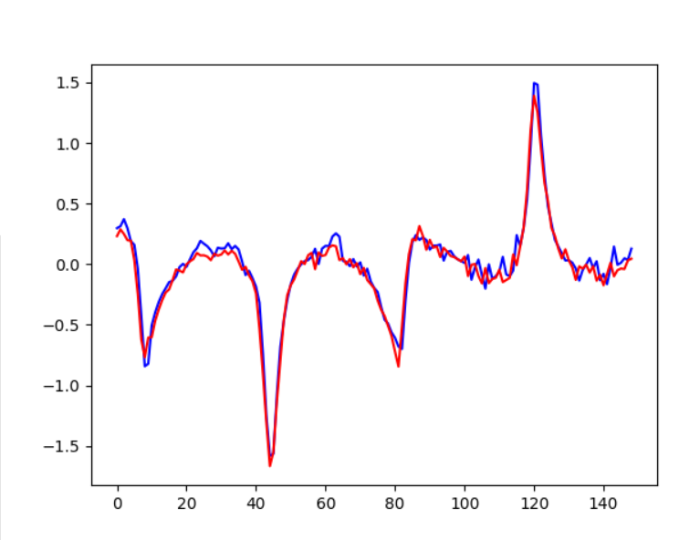
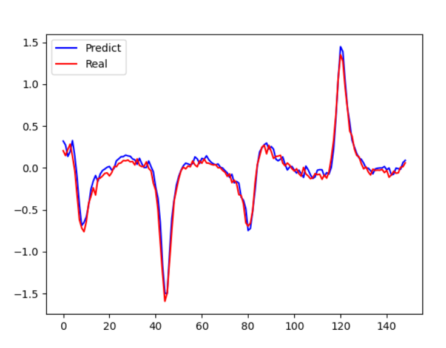
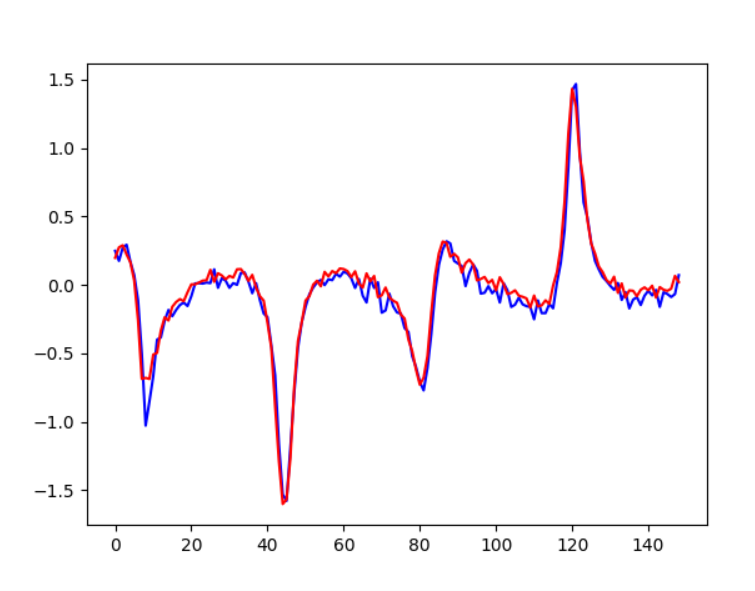
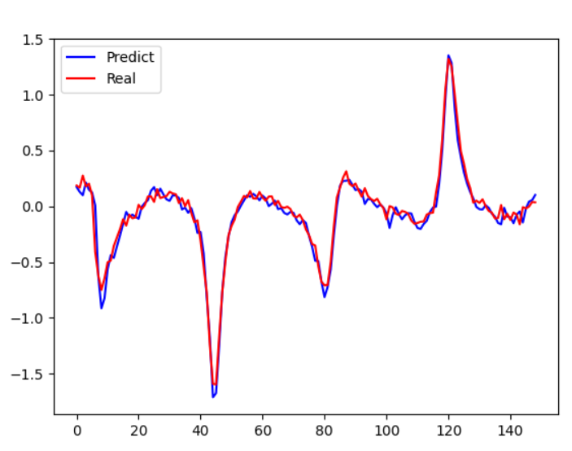
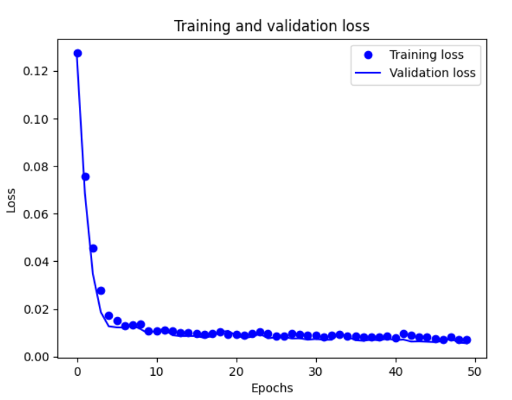
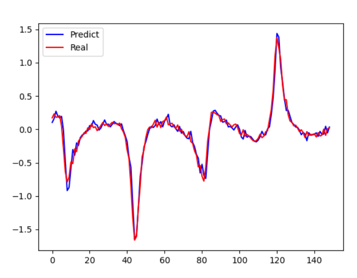

# Практика №7

#### Вариант №5

Задача:

Необходимо построить рекуррентную нейронную сеть, которая будет прогнозировать значение некоторого периодического сигнала.

К каждому варианту предоставляется код, который генерирует последовательность. Для выполнения задания необходимо:

1. Преобразовать последовательность в датасет, который можно подавать на вход нейронной сети (можно использовать функцию gen_data_from_sequence из примера)
2. Разбить датасет на обучающую, контрольную и тестовую выборку
3. Построить и обучить модель
4. Построить график последовательности, предсказанной на тестовой выборке (пример построения также есть в примере). Данный график необходимо также добавить в pr

Также, в файлах с кодом вариантов есть функция draw_sequence, которая позволяет нарисовать часть последовательности

### Выполнение работы

Преобразование последовательности в датасет и разбиение выборки на обучающую, контрольную и тестовую выборку было взято из примера, приведённого в методических указаниях. 

```
def gen_data_from_sequence(seq_len=1000, lookback=10):
    seq = gen_sequence(seq_len)
    past = np.array([[[seq[j]] for j in range(i, i + lookback)] for i in range(len(seq) - lookback)])
    future = np.array([[seq[i]] for i in range(lookback, len(seq))])
    return (past, future)


data, res = gen_data_from_sequence()
dataset_size = len(data)
train_size = (dataset_size // 10) * 7
val_size = (dataset_size - train_size) // 2

train_data, train_res = data[:train_size], res[:train_size]
val_data, val_res = data[train_size:train_size+val_size], res[train_size:train_size+val_size]
test_data, test_res = data[train_size+val_size:], res[train_size+val_size:]
```



Создание и исследование модели

Результаты первоначальной модели:





Далее, экспериментальным путём было выявлено следующее:

- Увеличение нейронов приводит к улучшению работы сети, но только до определенного момента 
  

  

- Удаление dropout из слоя LSTM приводит к улучшению работы
  

- Увеличение числа эпох практически не изменяет работу сети
  

- Из оптимизаторов - Adam показывает наилучшие результаты (картинка ниже)

- Изменение коэффициента исключения не особо сказывается на результатах работы

  


Результаты наилучшей модели:



