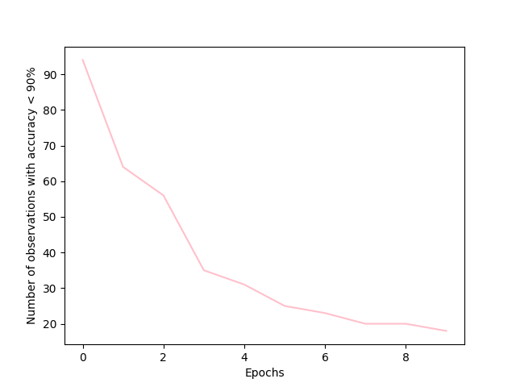

# Практическое задание №8, вариант 5

###  **Задание**

На каждой эпохе расчет количества наблюдений для которых точность классификации меньше 90%. В конце обучения построения и сохранение графика изменения рассчитываемой величины

### Выполнение работы:

Был реализован собственный CallBack и проведено обучение модели из практического занятия №6 с написанным CallBack’ом.

Для подсчёта количества наблюдений для которых точность классификации меньше 90%, был реализован следующий код:

```
for i in range(len(predicted)):
    if abs(self.Labels[i] - predicted[i]) >= 0.1:
        count_in_epoch += 1
```

Соответственно, если данная разница меньше 0.1, то точность уже выше заданного процента.

Количество наблюдений хранится в списке *count*.

Функция отрисовки вызывается уже после обучения (где также происходит сохранение в файл):

```
def on_train_end(self, logs=None):
    print(self.count)
    plt.plot(self.count, color='pink')
    plt.ylabel('Number of observations with accuracy < 90%')
    plt.xlabel('Epochs')
    plt.savefig('graphic.png')
    plt.show()
```

График изменения рассчитываемой величины:




